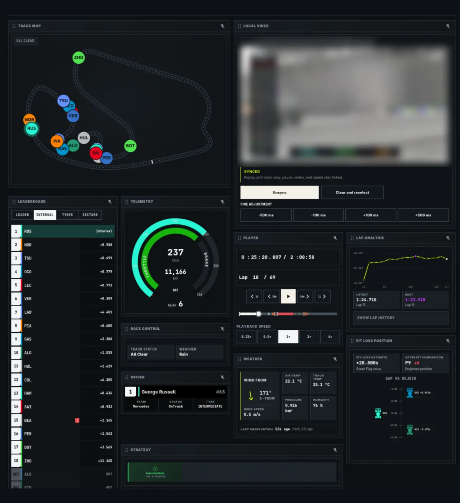
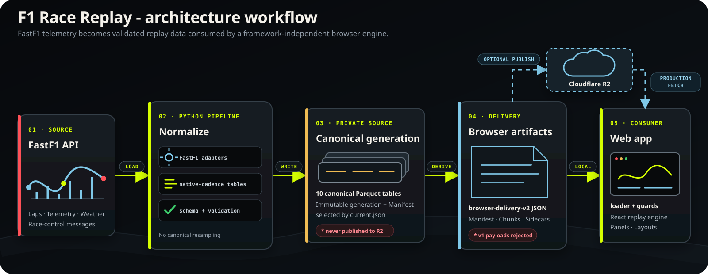

# F1 Race Replay

F1 Race Replay combines a modern browser replay application with a deterministic
FastF1 data pipeline. The preserved Python desktop application remains available
as a separate, historical workflow.

**Live app:** [f1racereplay.app](https://f1racereplay.app/)



<p align="center"><sub>F1 Race Replay Workspace - Custom layouts with lockable and unlockable panels.</sub></p>

## What is here

- **Web replay** - browse published sessions with playback, telemetry,
  leaderboard, track, tyre, and session-specific panels.
- **Canonical pipeline** - normalize FastF1 sessions into validated,
  native-cadence tables, then derive browser delivery artifacts.
- **Replay contracts** - versioned schemas, offline fixtures, loaders, and
  validation for the browser boundary.
- **Preserved desktop app** - the legacy Arcade application and its tests;
  it is not a migration or compatibility path for the browser replay.

## Prerequisites
- Node.js `>=22.12.0` for the web package (CI uses Node 24)
- npm

Create the project environment and install the modern pipeline from the
repository root:

```bash
python3 -m venv .venv
.venv/bin/python -m pip install --constraint pipeline/constraints.txt pipeline/
```

## Run the full workflow locally

From the repository root, generate the canonical and browser artifacts together
with the local season catalog:

```bash
.venv/bin/f1-replay-pipeline generate --year 2026 --round 3 --session R
```

Then start the web application:

```bash
cd web
npm ci
npm run dev
```
That's it, you are good to go.

No replay-data
configuration is required for local development: `generate` writes to
`artifacts/seasons/<year>/` by default, and Vite exposes that directory through
its `/@fs/.../artifacts/seasons/` URL. Set `VITE_REPLAY_SEASONS_BASE_URL` only
when the artifacts are hosted elsewhere, such as object storage, a CDN, or a
custom server:

```bash
VITE_REPLAY_SEASONS_BASE_URL=https://data.example.test/seasons/ npm run dev
```

For production, `web/.env.production` configures the frontend to load season
data from `https://data.f1racereplay.app/seasons/`, backed by Cloudflare R2.

## Architecture



### Repository structure

```text
.
├── web/                         # Vite + React replay application
├── pipeline/                    # FastF1 ingestion and replay-data generation
├── contracts/replay-data/v2/   # Active browser contract, schemas, and fixtures
├── docs/                        # Architecture, runtime, testing, and operations
├── tests/contracts/             # Cross-boundary replay contract tests
├── artifacts/                   # Generated local data; not committed
│   └── seasons/<year>/
│       ├── canonical/           # Private canonical Parquet generations
│       ├── browser/             # Derived browser-delivery-v2 artifacts
│       └── catalog.json         # Season catalog loaded by the web app
└── legacy/                      # Preserved historical desktop application
```

## Known limitations

- Position, gap, finish, and pit-loss quality depends on available telemetry and
  leader history; calibration remains provisional pending a multi-circuit corpus.
- Missing optional evidence is unavailable, not inferred. Non-race sessions do
  not expose race-order, gap, finish, DNF, or pit-loss claims.
- F1 does not publish 2026 Overtake Mode, active-aero, or ERS-replacement
  telemetry to FastF1; the UI must not present unavailable DRS-related data as
  measured `DRS: Off`.

## Documentation map

- [Web setup and replay flow](web/README.md)
- [Pipeline installation and commands](pipeline/README.md)
- [Active replay-data v2 contract](docs/replay-data-contract.md)
- [Browser boundary and publication invariants](docs/browser-delivery-interface-freeze.md)
- [Browser runtime semantics](docs/browser-replay-engine-runtime-semantics.md)
- [Canonical schema](docs/canonical-pipeline-schema.md) · [Parquet writer contract](docs/canonical-parquet-writer-contract.md)
- [Testing and CI commands](docs/Testing.md)
- [R2 production publishing](docs/r2-production-publishing.md)
- [Generated state and repository hygiene](docs/repository-hygiene.md)
- [Preserved legacy desktop application](legacy/README.md)

## License

Original F1 Race Replay project code outside `legacy/` is available under the
[MIT License](LICENSE). Preserved material under `legacy/` is excluded from that
grant pending verified upstream rights; see [legacy/UPSTREAM.md](legacy/UPSTREAM.md)
for provenance and [THIRD_PARTY_NOTICES.md](THIRD_PARTY_NOTICES.md) for
dependency notices.
